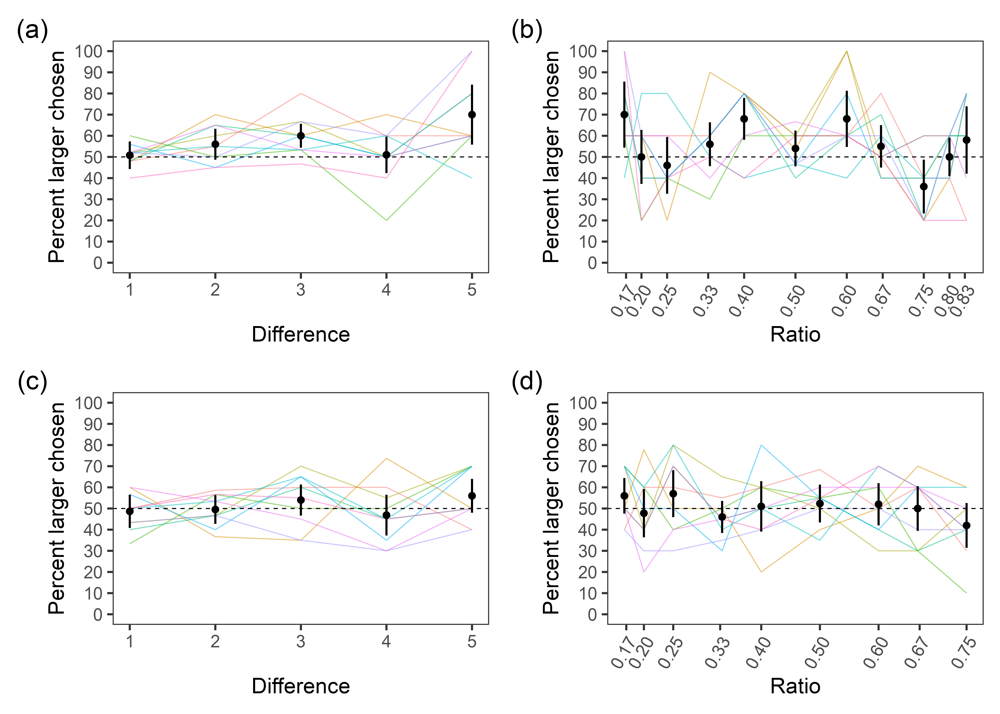

```{r setup, include = FALSE, echo = FALSE}

library(here)
library(patchwork)
library(formattable)
library(knitr)
library(rmarkdown)
library(papaja)
library(formatstats)
library(flextable)
library(psych)

source("wolff_etal_2023_rcode.R")
r_refs(file = "docs/r-references.bib")
my_citations <- cite_r(file = "r-references.bib", pkgs = c("BayesFactor", "bayestestR", "ggcorrplot", "here", "lme4", "papaja", "patchwork", "performance", "psych", "tidyverse"), withhold = FALSE)

```

# Introduction

When a hungry pinyon jay (_Gymnorhinus cyanocephalus_) flies to a grove of pine trees, should they choose the tree with just a few pine cones or the tree with several dozen? Later in the season when they are looking for a mate, should they join a flock of 10 birds or 50? Animals often must make choices between different quantities of options across a wide range of contexts, such as foraging for food and selecting social partners. Yet little is known about how animals use information about quantity across these contexts.

Quantification skills have strong adaptive value for survival and reproduction [@Nieder.2018], playing roles in navigation, predator avoidance, territory defense, foraging, courtship, and mating [@Arak.1983;@White.etal.2009;@Carazo.etal.2012;@Yang.Chiao.2016;@Agrillo.etal.2017;@Nieder.2020]. And many animal species have demonstrated the ability to quantify objects in their environment, including arthropods [@Dacke.Srinivasan.2008], fish [@Agrillo.Dadda.2007;@Agrillo.etal.2008; @Agrillo.etal.2011], amphibians [@Uller.etal.2003], birds [@Xia.etal.2001;@Emmerton.Renner.2006;@Emmerton.Renner.2009], and mammals [@Call.2000;@Beran.2001;@Vonk.Beran.2012; @Nieder.2018]. These abilities have been studied across a range of objects and contexts, using several different experimental techniques [@Agrillo.Beran.2013;@Agrillo.Bisazza.2014]. In _food preference tasks_, for instance, animals are presented with two different quantities of food and are allowed to consume the chosen quantities. Animals should choose the larger rewards when they (1) can discriminate between the two quantities and (2) are motivated to choose and consume more food. Importantly, a lack of preference does not mean an inability to discriminate [@Mendelson.etal.2016]. _Discrimination_ requires an animal to recognize two things as different whereas _preference_ signifies a desire for one choice over the other. A preference implies discrimination, but lack of a preference does not imply an absence of discrimination. Most studies of quantification conflate these two types of tasks, but they are important to distinguish [@Agrillo.Bisazza.2014].

Most of the tasks designed to measure quantitative cognition use food or computer stimuli as quantifiable objects [@Call.2000;@Beran.2001;@Scarf.etal.2011;@Rugani.etal.2013;@Kelly.2016;@Potrich.etal.2022]. Yet other objects are also important to quantify. Quantities of conspecifics, for example, are important for avoiding predators by diluting their probability of being captured [@Hamilton.1971]. And animals are sensitive to conspecific quantities in the wild, preferring larger over smaller groups to join [@Emmerton.2001;@Krause.Ruxton.2002;@Silk.etal.2014] or comparing their current group size to the size of a rival group during competition [@McComb.etal.1994;@Wilson.etal.2001;@Kitchen.2004]. In _social preference tasks_, animals (primarily fish) have been given the choice between joining groups of different quantities of conspecifics to assess quantification, and they are sensitive to conspecific quantity [@Buckingham.etal.2007;@Agrillo.etal.2008;@Potrich.etal.2015;@Gomez-Laplaza.Gerlai.2016;@Messina.etal.2022].

Despite existing work on quantifying food and conspecifics, little research has directly compared quantitative cognition across different types of objects to assess whether animals use quantity information similarly across these contexts. One of the key cognitive processes proposed for quantification is the _approximate number system_, which involves the estimation of quantity without relying on language or symbols [@Feigenson.etal.2004;@Nieder.2020]. The approximate number system is characterized by two key effects [@Dehaene.etal.1998;@Ditz.Nieder.2016]. For the _numerical distance effect_, discrimination improves with increasing numerical difference between two values (i.e., mathematical difference between two numbers: 4 $-$ 2 has a difference of 2). Discrimination becomes easier as the difference increases and the options become more dissimilar. For the _numerical ratio effect_, discrimination improves as the numerical ratio (i.e., mathematical quotient between two numbers: 2/4 has a ratio of 0.5) between values decreases. Discrimination becomes easier as the numerical ratio moves away from 1. The numerical ratio effect has been formalized as Weber's Law, which quantifies the perceived change between two stimuli and predicts that change detection depends on the stimuli's ratio [@Fechner.1860]. Animals typically discriminate food quantities and group sizes better when there are larger numerical differences  [@Agrillo.Dadda.2007;@Agrillo.etal.2008;@Kelly.2016] and smaller numerical ratios [@Cantlon.Brannon.2006; @Hanus.Call.2007;@Evans.etal.2009;@Tornick.etal.2015;@Potrich.etal.2015;@Bisazza.Santaca.2022], supporting the numerical distance and ratio effects respectively.

Data showing distance and ratio effects illustrate the use of approximate amounts rather than precise numbers. But difference and ratio are not independent; they are highly correlated [@Lyons.etal.2015]. As difference increases, ratio decreases. Thus, it is possible for animals to use either difference or ratio or both to quantify objects. For instance, quantity tasks in some species show effects of ratio but not difference [@Cantlon.Brannon.2006;@Buckingham.etal.2007;@Gomez-Laplaza.Gerlai.2011;@Tornick.etal.2015], whereas other studies show effects of both difference and ratio, with the other held constant [@Agrillo.etal.2007;@Kelly.2016;@Bisazza.Santaca.2022]. This is important because Weber's Law predicts that only ratio should drive discrimination---difference should not influence discrimination above and beyond ratio [@Cantlon.Brannon.2006]. Therefore, an independent contribution of difference suggests an additional quantitative process beyond the ratio-dependence of Weber's Law.


## Present Study

Pinyon jays, a highly social species of North American corvid [@Balda.Kamil.1998], are well-suited for examining effects of context on quantitative cognition because of their diet and social habits. They live in flocks ranging from 50 to 500 birds with fission-fusion dynamics in which members of a community form frequently changing subgroups  [@Marzluff.Balda.1992]. Fission-fusion group living reduces predation risk and improves foraging success [@Lehmann.etal.2007;@Dange.etal.2021]. This is relevant to quantification, as birds in fission-fusion groups must often choose between breaking off into a smaller sub-group or rejoining the larger colony. One of the largest motivators of this decision-making process is foraging benefit [@Silk.etal.2014]. Pinyon jays forage for protein-rich pine nuts, which they cache and rely on in the winter [@Marzluff.Balda.1992]. The need to retrieve cached food sources may place strong selection pressure on quantitative cognition, as they need to store as many pine seeds as possible to survive the winter. Thus, pinyon jays rely on assessing the quantity of birds in a flock for social living decisions and the quantity of food items available for foraging decisions.

The primary aim of the present study was to investigate how pinyon jays use numerical difference and ratio to choose between different quantities of food items or conspecifics. To address this aim, we offered pinyon jays a series of choices between smaller and larger quantities of either food items or conspecifics. To address our research question, we tested three hypotheses. Our first hypothesis posits that pinyon jays will, on average, prefer larger over smaller quantities. An animal is more likely to survive if they consume more food and live in larger rather than smaller groups. Our second hypothesis posits that pinyon jays will show stronger preferences for more items when the numerical pairs have higher numerical differences and lower numerical ratios. As differences and ratios move away from 1, discrimination becomes easier. Our third hypothesis posits that both numerical difference and ratio will influence preference independently of each other. Whereas discrimination tasks in primates show only ratio effects [@Cantlon.Brannon.2006], numerical judgment tasks in humans show independent effects of difference and ratio [@Stevens.Soh.2018]. We suggest that the preference tasks used here are more comparable to those human numerical judgment tasks than discrimination tasks used in primates; therefore, we predict that results from our preference tasks will mirror results found in human numerical judgment tasks.

# Method

We conducted experiments to investigate quantification of both food and conspecifics. Each experiment was replicated with two sets of birds, and most subjects experienced both the food and social experiment. Videos are available in the supplementary materials at https://osf.io/g45nk/.

## Subjects

Our study population of `r length(subject_bird_info$subject)` pinyon jays (_Gymnorhinus cyanocephalus_) was wild born and locally housed. We intended to use all 35 pinyon jays in the colony, all of which completed some stages of training. The resulting `r length(subject_bird_info$subject)` pinyon jays used in the study were the only birds that passed our training criteria. Researchers captured these birds in either Arizona or California (United States Fish and Wildlife permit MB694205) between 2006 and 2011. At capture, they were estimated to be between one and three years of age. At the end of the experiments, they ranged between `r min(c(subject_ages, stooge_ages_df$age))`-`r max(c(subject_ages, stooge_ages_df$age))` years old. The University of Nebraska-Lincoln Institutional Animal Care and Use Committee approved this project (protocols #1709 and #2059), and all procedures conformed to the ASAB/ABS Guidelines for the use of animals in research. All subjects completed prior cognitive and behavioral experiments and were handled by humans extensively during their time in the lab.

This project consisted of two replicates of each experiment. Within a replicate, the food and social experiments ran concurrently with separate birds as subjects. After the first replicate, most birds switched experiments for the second replicate. For replicate 1, `r nrow(food_subjects |> filter(rep == 1))` pinyon jays (`r nrow(food_subjects |> filter(rep == 1 & sex == "Female"))` female) completed all rounds of the food experiment from `r format(min(food1$date), format = "%B %Y")` to `r format(max(food1$date), format = "%B %Y")`, and `r nrow(social_subjects |> filter(rep == 1))` jays (`r nrow(social_subjects |> filter(rep == 1 & sex == "Female"))` female) completed all rounds of the social experiment from `r format(min(social1$date), format = "%B %Y")` to `r format(max(social1$date), format = "%B %Y")`. A further `r nrow(filter(stooge_bird_info, !is.na(social1_trials)))` jays (`r nrow(filter(stooge_bird_info, !is.na(social1_trials) & sex == "Female"))` female) were used as conspecifics in the social experiment. Two jays were dropped from the social experiment due to unrelated health concerns. For replicate 2, `r nrow(food_subjects |> filter(rep == 2))` pinyon jays (`r nrow(food_subjects |> filter(rep == 2 & sex == "Female"))` female) completed all rounds of the food experiment from `r format(min(food2$date), format = "%B %Y")` to `r format(max(food2$date), format = "%B %Y")`, and `r nrow(social_subjects |> filter(rep == 2))` jays (`r nrow(social_subjects |> filter(rep == 2 & sex == "Female"))` female) completed all rounds of the social experiment from `r format(min(social2$date), format = "%B %Y")` to `r format(max(social2$date), format = "%B %Y")` (Table \@ref(tab:subjectinfotablelatex)). A further `r nrow(filter(stooge_bird_info, !is.na(social2_trials)))` jays (`r nrow(filter(stooge_bird_info, !is.na(social2_trials) & sex == "Female"))` female) from the colony were used as conspecifics in the social experiment.  For social replication 2, we removed the three most popular birds from social repetition 1 to better control for individual preference across conspecifics. Four birds (1 female) served as both subjects and conspecific birds in separate replicates of the social experiment. A bird was never both a subject and a conspecific during the same replicate. See Table \@ref(tab:subjectinfotablelatex) for the order of experiments for each subject bird.

The jays in the food experiment were housed in pairs, whereas the subjects in the social experiment were individually housed and the conspecifics were group housed. Upon completion of the first phase of experiments birds were changed to the opposite housing type to stay consistent. Subjects were not food restricted in either experiment. 

## Numerical Pairs

We used the same set of all  `r nrow(factorial_pairs_df)` possible numerical pairs between 1 and 6 (e.g., 1 vs 2, 1 vs 3, 1 vs 4, etc.) for all four experiments except the second social experiment, which used all but four of the pairs (Table \@ref(tab:pairstablelatex)). We chose these numerical pairs because they systematically include all numerical pairs for numbers 1-6, which provides a good distribution of differences and ratios. Within these `r nrow(factorial_pairs_df)` pairs are the differences `r min(factorial_pairs_df$Difference)` through `r max(factorial_pairs_df$Difference)` and ratios of `r str_c(formatstats::format_num(sort(unique(factorial_pairs_df$Ratio)), digits = 2), collapse = ", ")`. To reduce the number of birds needed for the second social experiment, we removed the four numerical pairs that required nine or more conspecific birds.

<!--(pairstable)-->

```{r pairstablelatex, eval = TRUE}

factorial_pairs_df |>
  mutate(Pair = ifelse(Social_2 != "X", paste0(Pair, kableExtra::footnote_marker_symbol(1, "latex")), Pair)) |>
  select(-Social_2) |>
  knitr::kable(booktabs = TRUE,
               format = "latex",
               digits = c(0,0,2),
               linesep = "",
               escape = FALSE,
               align = "lcc",
               caption = "Factorial Pair Combinations",
               col.names = c("Pair", "Difference", "Ratio")) |>
  kableExtra::kable_styling(latex_options = "hold_position") |>
  kableExtra::footnote(symbol = "Pairs not used in Social 2.")# = "", footnote_order = c("symbol", "general"), threeparttable = TRUE)

```

```{r pairstableword, eval = FALSE}

pairstable <- factorial_pairs_df |> 
  mutate(Pair = ifelse(Social_2 != "X", paste0("  ", Pair, "*"), Pair),
         Ratio = format_num(Ratio, digits = 2)) |> 
  select(-Social_2) |> 
  flextable() |> 
  set_caption("Factorial Pair Combinations") |> 
  width(j = 2, width = 1) |> 
  align(align = "center", part = "all") |> 
  font(part = "all", fontname = "Times New Roman") |> 
  add_footer_lines(values = as_paragraph("* Pairs not used in Social 2.\nNote. "))
set_table_properties(pairstable, layout = "fixed")

```

## Food Experiment

The apparatus for the food experiment included a bird cage (72 $\times$ 48 $\times$ 48 cm) abutting a plastic stand with sliding trays that contained mealworms (Figure \@ref(fig:foodapp)). The stand was set at a 15 degree angle tilted toward the subject to facilitate mealworm viewing. The stand included two channels that guided Plexiglas trays. Each Plexiglas tray had a standard petri dish placed 1.5 cm away from the front. Mealworms were placed in the front two-thirds of the petri dish so the subjects could easily reach them, and they were evenly distributed across the available area. The cage included three perches: one larger free-standing perch toward the back of the cage and two smaller perches attached to each side of the front of the cage. Subjects started each trial perched on the back perch, and they chose an option by landing on one of the front perches. The unchosen tray was slid out of reach, and the subjects then consumed the mealworms on the chosen side (see Supplementary Video).

<!--(foodapp)-->
<!--word _Figure 1._ word-->

<!--word Food Experiment Apparatus word-->


```{r foodappword, eval = FALSE}
#| out-width: "75%"
#| fig-cap: "_Note_. Overhead view. Subjects started the trial on the back perch and hopped forward to one of the front perches to signal choice. The experimenter sat on the other side of the stand and slid the opposite tray out of reach, allowing the subject to consume their chosen mealworms. Figure used with permission under a CC-BY4.0 license: Wolff et al.\ (2023); available at https://doi.org/10.31234/osf.io/kxgwt."

knitr::include_graphics("figures/food_apparatus.png")

```

\begin{figure}[t]
\caption{\newline \emph{Food Experiment Apparatus} \label{fig:foodapp}}
\begin{center}
\includegraphics[width=0.75\linewidth]{"figures/food_apparatus.png"}
\end{center}

\textit{Note.} Overhead view. Subjects started the trial on the back perch and hopped forward to one of the front perches to signal choice. The experimenter sat on the other side of the stand and slid the opposite tray out of reach, allowing the subject to consume their chosen mealworms.
\end{figure}


## _Habituation and Training_
Prior to experimental sessions, all birds were habituated to the experimental room, cage, and stand and then experienced training. Depending on the bird, this took between 9-16 weeks, as each bird ran once a day between 11:00-15:00 CT. Subjects experienced four training phases in total, each meant to teach the bird a different piece of the paradigm. 

The first phase (rear cup habituation) habituated subjects to the apparatus. For _rear cup habituation_, the experimenter brought a subject from their home cage and released them into the test cage. Five mealworms were placed in each of the two feeding bowls into slots at the back of the cage. After three minutes.the experimenter counted the number of mealworms consumed in each food dish and returned the subject to its home cage.

The second phase (front dish habituation) encouraged the birds to place their heads through holes at the front of the cage to consume mealworms from the dishes on the trays. _Front dish habituation_ was similar to rear cup habituation, except three mealworms were placed in both dishes on the Plexiglas trays. The experimenter pushed the trays forward to present the dishes to the subject in one swift and smooth motion. After three minutes.the experimenter counted the number of mealworms eaten in each dish and returned the subject to their home cage.

The third phase (moving dish training) introduced the subjects to the fact that the dish on the unchosen side moved out of reach. _Moving dish training_ was identical to  front dish habituation, except the experimenter pulled back the tray in front of the unchosen perch. If subjects ate all three mealworms before three minutes.xpired, we repeated this process. If the bird did not finish their mealworms, we waited the rest of the three minutes.efore returning them to their home cage.

The fourth phase (mixed reward training) taught the subjects to quickly make a choice between zero or three mealworms, eat, and then set up for another trial in quick succession. The _mixed reward training_ was identical to the moving dish training, except one of the dishes held no mealworms whereas the other held three mealworms. Subjects completed six of these 30-second trials per session.

Subjects progressed to a new phase after consuming at least 70% of the mealworms offered in their current phase for three consecutive days. Subjects could also regress to a previous phase if they consumed less than 25% of the mealworms offered on five out of seven days of training. 

## _Experimental Procedure_

All experimental sessions ran between 11:00-15:00 CT. The subjects were not on a restricted diet and were fed for the day directly after completing their respective test trials. One experimenter conducted each session. The first trial of the session consisted of one round of mixed reward training. If they failed this check, the experimenter completed two more rounds of mixed reward training. If they failed two out of three of these trials, this triggered de-bias training. If they succeed, they continued to the experimental trials. 

At the beginning of each trial, the experimenter placed the appropriate number of mealworms 2.5 cm apart in each dish out of sight from the birds. The subject then started the trial on the back perch and hopped forward to one of the front perches to signal choice. The experimenter then removed the opposite dish, and the subject had up to three minutes.o consume the mealworms within the chosen dish (see Supplementary Video). If the subject did not make a choice and/or finish all mealworms within three minutes.we ended the session. Once the subject consumed all mealworms, we immediately started the next trial. The first trial in which the subject did not finish all their chosen mealworms triggered a stop for that day's session. Subjects completed on average `r mean(sessions_avg_food1$n)` trials per session for replicate 1 and `r mean(sessions_avg_food2$n)` trials per session in replicate 2 with one session per day. Subjects ran in a randomized order each day. Each bird experienced 10 repetitions for each of the 15 numerical pairs between 1 and 6 (Table \@ref(tab:pairstablelatex)). The pairs were organized into blocks with one instance of each pair per block and order was randomly shuffled within each block.

## _Side-Bias Protocol_

During habituation, three consecutive days of no choices and/or not eating mealworms on one side triggered side de-bias training. During experimental sessions, there were two triggers for de-bias training: either not completing the first 0 vs. 3 practice test trial correctly or when a bird chose the same side for 10 consecutive trials. De-biasing training consisted of three mealworms placed in the dish the subject avoided and no mealworms in the side they preferred. The subject was allowed up to one minute to select the dish that contained mealworms. If the bird did not make a choice or eat any mealworms in the allotted time, we removed the trays from the stand, placed them out of view of the bird, waited a few seconds, then began the trial over. If they ate within the minute, we reset as soon as they ate until they had five total opportunities to eat. The bird returned to habituation or experimental sessions once they successfully chose the avoided side immediately and ate at least 60% of the mealworms provided. 

## Social Experiment

## _Apparatus_ 

The apparatus for the social experiment was a Y-maze formed out of chicken wire, plastic sheets, and Plexiglas (Figure \@ref(fig:socialapp)). The subject entered a large chamber at the base of the maze before choosing one of two arms of the Y-maze. At the entrance to both arms, transparent guillotine-style doors were closed after the bird walked or flew past them, thus making a choice between the option on the left or right. At the end of each arm, was a large bird cage (72 $\times$ 48 $\times$ 48 cm) housing the conspecific birds. Each cage had two lengthwise perches for the conspecific birds to use and one small perch hanging from the top.


<!--(socialapp)-->
<!--word _Figure 2._ word-->

<!--word Social Experiment Apparatus word-->

```{r socialappword, eval = FALSE}
#| out-width: "65%"
#| fig-cap: "_Note_. Overhead view. Subjects were held inside the main chamber of the Y maze and shown each group of conspecifics for six seconds a piece. They were then released into the chamber to make a choice. Once the subject crossed under a door, the doors were closed and the bird stayed with their chosen conspecific(s) for three minutes."


```

\begin{figure}
\caption{\newline \emph{Social Experiment Apparatus} \label{fig:socialapp}}
\begin{center}
\includegraphics[width=0.65\linewidth]{"figures/social_apparatus.png"}
\end{center}

\textit{Note.} Overhead view. Subjects were held inside the main chamber of the Y maze and shown each group of conspecifics for six seconds a piece. They were then released into the chamber to make a choice. Once the subject crossed under a door, the doors were closed and the bird stayed with their chosen conspecific(s) for three minutes.
\end{figure}

## _Habituation and Training_

Prior to experimentation, we habituated all birds to both the experimental room and the apparatus to ensure that neither the handling of the birds nor anything within the room would cause our subjects stress. For habituation, we attached a food cup to the front of each bird cage. For a habituation session, the experimenter placed five mealworms in each of the cups. The experimenter then brought the subject into the room, opened both doors, and showed the subject each arm of the maze for six seconds, randomizing between subjects the side shown first. The subject was then gently placed on the bottom of the testing chamber as close to the center as possible with the bird facing away from their options. Once the subject crossed the threshold of a door, the door was closed behind them, and the bird could explore the chosen arm and consume the mealworms for two minutes. After the two minutes expired, the experimenter removed the subject from the apparatus and recorded the number of mealworms consumed. 

Subjects experienced one habituation session per day for five days a week. They completed habituation once they consistently consumed at least 80% of the mealworms offered to them in both arms of the apparatus and had no signs of a side bias. Depending on the bird, this took between 4-6 weeks.

## _Experimental Procedure_

All experimental sessions ran between 09:00-17:00 CT, with birds being run once or twice a day depending on personnel. The subjects were not food restricted. During replicate 1, two experimenters were present at each session: the ‘handler’ handled the subject, while the ‘recorder’ handled the camera and the guillotine doors. The experimenter placed the conspecific birds in their respective cages and allowed them to acclimate to the room for 10 minutes before experimentation. The handler then placed  the subject inside the apparatus and showed them each option for six seconds (counter balancing which was shown first) before releasing the subject into the chamber (see Supplementary Video). Once the subject crossed the threshold of one of the doors, the recorder closed both doors. After three minutes.lapsed, the handler collected the subject and returned them to their home cage. These steps repeated until all birds had run through the experiment. During replicate 2, the experimenter completed the duties of both handler and recorder.

For replicate 1, each subject experienced five repetitions for each of the 15 numerical pairs between 1 and 6 (Table \@ref(tab:pairstablelatex)). The side of the larger option was pseudo-randomized with no left or right runs longer than three in a row. The pairs were organized into blocks with one instance of each pair per block and pairs randomly shuffled within each block. The order in which the subjects ran in a particular day was also randomly shuffled.  Subjects experienced one trial per session and one session per day.   Conspecific birds participated in a mean of `r printnum(mean(stooge_bird_info$social1_trials, na.rm = TRUE), digits = 1)` and a median of  `r printnum(median(stooge_bird_info$social1_trials, na.rm = TRUE), digits = 1)` sessions across the replicate. 

For replicate 2, each bird experienced 10 repetitions for each of the 15 numerical pairs between 1 and 6 except for the four pairs that required more than eight conspecific birds (4:5, 3:6, 4:6, 5:6). This was done in an effort to better account for individual bird preference among the subjects for certain conspecific birds. Randomization was the same as replicate 1.  Subjects experienced one trial per session and one to two sessions per day. Conspecific birds participated in a mean of `r printnum(mean(stooge_bird_info$social2_trials, na.rm = TRUE), digits = 1)` and a median of  `r printnum(median(stooge_bird_info$social2_trials, na.rm = TRUE), digits = 1)` sessions across the replicate.   

## _Side-Bias Protocol_

If any subject chose either the left or right side for six consecutive sessions in either habituation or experimentation, they experienced side de-biasing. For side de-biasing, only one door was open in the apparatus, the door leading to the side the subject avoided. We placed five mealworms in the food cup at the end of that arm with no conspecific birds present. The bird had up to five minutes to walk/fly past the door into the correct side and three minutes.nce the door shut behind them to eat the mealworms. Subjects experienced five consecutive trials in a de-biasing session. The subject returned to habituation or experimental sessions once they successfully choose the avoided side immediately upon release and ate at least 60% of the mealworms provided.


## Inter-Rater Reliability

All data were live coded during sessions and also video recorded. JRS recoded choices from video recordings for about 5% of the sessions for each of the four studies. Although not naive to the hypotheses tested, JRS did not collect any of the original data and obscured the stimuli such that he could not view how many items were on each side when recoding choices. We used Cohen’s kappa to assess the inter-rater reliability of the binary response variable for the side of choice (right or left). For the food data, the recoded trials were in complete agreement with the original data ($\kappa$ = `r apa_num(food_reliability$kappa)`, N = `r food_reliability$n.obs`). For the social data, the agreement was very good ($\kappa$ = `r apa_num(social_reliability$kappa)`, 95% CI [`r apa_num(social_reliability$confid[1])`, `r apa_num(social_reliability$confid[5])`], N = `r social_reliability$n.obs`).


## Data Analysis

Data were analyzed and processed for the project using `r my_citations`. The manuscript was created using _rmarkdown_  [Version `r packageVersion("rmarkdown")`, @R-rmarkdown_a] and _papaja_ [Version `r packageVersion("papaja")`, @R-papaja]. Data, analysis scripts, supplementary materials, and reproducible research materials are available at the Open Science Framework (https://osf.io/g45nk/).

We drew inferences based on Bayes factors (_BF_~10~), which offer the ratio of evidence for the alternative hypothesis (H~1~) over evidence for the null hypothesis (H~0~) [@Wagenmakers.2007; @Wagenmakers.etal.2010]. Therefore, a Bayes factor of 3 indicates three times more evidence for H~1~ than H~0~, whereas a Bayes factor of 1/3 (the reciprocal of 3) indicates three times more evidence for H~0~  than H~1~. We interpreted Bayes factors based on Wagenmakers et al. [-@Wagenmakers.etal.2018], where a _BF_~10~ > 3 is moderate evidence for the alternative hypothesis, _BF_~10~ < 1/3 is moderate evidence for the null hypothesis, and 1/3 < _BF_~10~ < 3 indicate neither hypothesis has sufficient evidence supporting it (suggesting the sample size is too small to draw conclusions). In addition, Bayes factors of 10 (1/10), 30 (1/30), and 100 (1/100) represent strong, very strong, and extreme evidence, respectively.

Prior to analysis, we transformed the left and right choice variable from each trial into a binary outcome, with 1 representing a choice for the larger option and 0 representing a choice for the smaller option. We also created variables with the numerical difference between each numerical pair by subtracting the larger number from the smaller (6 $-$ 1 = 5), as well as created the ratio by dividing the smaller by the larger number (1/6 = 0.17). Our hypotheses explore the relationship between our binary outcome variable (choice of the larger or smaller stimuli) and which possible numerical relationships (difference or ratio) predict subjects' choices when presented with either food or social items. 

Our first hypothesis investigated whether pinyon jays prefer larger over smaller numbers of food items and conspecifics. To test this, we conducted a one sample t-test of preference for larger numbers. Therefore, we calculated the mean _percent preference for larger quantities_ for each subject across all pairs and used the t-test to compare the subject means to 50. We performed both frequentist and Bayesian t-tests, with inferences based on Bayes factors. Bayes factors for t-tests were calculated using the `ttestBF` function from the _BayesFactor_ R package [@R-BayesFactor] using default, noninformative priors.

Our second hypothesis investigated whether numerical difference and ratio predict preferences between smaller and larger options, and the third hypothesis investigated whether difference and ratio predicted preferences _independently_. To test these hypotheses, we used generalized linear mixed-effects modeling, as the response variable was dichotomous and our subjects repeatedly made decision on the same numerical pairs. We used the trial-level choices for either the larger or smaller option available in the numerical pair as the response variable. To investigate our hypotheses, we used generalized linear (logistic) models to compare which combination of random (subject, pair, or both) and fixed (ratio, difference, or a combination of both) effects best describe each data set (food and social). We first found the best-fitting random effect structure, then added this random structure to all of the possible fixed effect structures. After comparing those models, we selected the final best-fitting model for each data set overall using Bayes factors comparing each random effects model to the intercept only model. 

To explore random effect structure, we included models with no fixed effect and either (1) no random effects (intercept only), (2) subject as a random effect, (3) numerical pair as a random effect (to account for each bird repeatedly seeing each pair multiple times), and (4) both subject and numerical pair as random effects. For example, the model with both subject and pair as random effects ran using the `glmer()` function from the _lme4_ package [@R-lme4] with the following structure: `glmer(choice ~ (1|subject)+ (1|pair), family = binomial)` (Table \@ref(tab:modeltablelatex)). We then used Bayes factors to select the model with the best-fitting random effect structure. We added the chosen random effect structure to our fixed effects to find the best-fitting model for the data set overall. The five fixed effects models were: (1) no fixed effects (intercept only), (2) ratio as a fixed effect, (3) difference as a fixed effect, (4) both difference and ratio as a fixed effects _without_ an interaction, and (5) both difference and ratio as fixed effects _with_ an interaction. The model with both difference and ratio as fixed effects with an interaction term ran using the `glm()` function and the following structure: `glm(choice ~ difference * ratio, family = binomial)` (Table \@ref(tab:modeltablelatex)). We calculated Bayes factors using the `test_performance()` function from the _performance_ package [@R-performance], which estimates Bayes factors by comparing model BIC values to the intercept only model BIC values using Wagenmakers' [-@Wagenmakers.2007] equation. The model with the highest Bayes factor is the best-fitting model. We then tested the best fitting model for outliers and for a linear relationship between the predictor and the logit of the response variable. All models presented here satisfy these assumptions.

We tested the second hypothesis by assessing whether the fixed effect models with difference only or ratio only outperformed the intercept only model. That is, we inferred that difference or ratio influences choice if the Bayes factors for their respective models exceed 3. We tested the third hypothesis by assessing whether the `difference + ratio` or `difference * ratio` models outperformed all other models. If pinyon jays choose more items based on differences and ratios independently of each other, then the best-performing model should include both difference and ratio. Evidence in support of either of these models would indicate that both difference and ratio predict choice independently. 

# Results

## Food Experiment

Our first hypothesis predicted that subjects (N~rep1~ = `r nrow(food_subjects |> filter(rep == 1))`, N~rep2~ = `r nrow(food_subjects |> filter(rep == 2))`) would on average choose the larger quantity of mealworms over the smaller quantity across all of the numerical pairs in the food preference task. Data for both replicates satisfied the Shapiro-Wilk normality test (Replicate 1: _W_ = `r format_num(food1_results$ttest_norm$statistic, digits = 2)`, `r format_p(food1_results$ttest_norm$p.value)`, Replicate 2: _W_ = `r format_num(food2_results$ttest_norm$statistic, digits = 2)`, `r format_p(food2_results$ttest_norm$p.value)`), so we proceeded to use parametric statistics. One sample t-tests provided moderate to strong evidence that preferences were above chance (50%) in both replicate 1 (`r format_ttest(food1_results$ttest)`, `r format_bf(food1_results$ttestbf)`) and replicate 2 (`r format_ttest(food2_results$ttest)`, `r format_bf(food2_results$ttestbf)`).

Our second and third hypotheses were investigated by comparing generalized linear models that included difference and/or ratio as predictors. Model comparisons allow us to investigate both the second hypothesis, that subjects would show stronger preferences for more items when the numerical pairs have higher differences and lower ratios, and the third hypothesis, that difference and ratio will influence preference independently of each other. For both replicates, the best-fitting random effect structure was no random effect structure, so we used no random effects in the subsequent fixed effect analysis. For the fixed effect model comparison, the model with only the main effect of ratio best fit both data sets (Replicate 1: `r format_bf(food1_results$fixed_table$BF[2])`, Replicate 2: `r format_bf(food2_results$fixed_table$BF[2])`). Thus, subjects in the food experiment used the ratio between the two numbers of mealworms to choose between options, with stronger preferences for larger options at smaller ratios (Figure \@ref(fig:foodgraphs)). The model with the main effect of difference showed evidence supporting stronger preferences for larger options at larger differences for replicate 1 but not replicate 2 (Replicate 1: `r format_bf(food1_results$fixed_table$BF[3])`, Replicate 2: `r format_bf(food2_results$fixed_table$BF[3])`). Consequently, this only partially supports our second hypothesis.  Additionally, our third hypothesis was not supported, as the models including both difference and ratio were outperformed by models only including ratio (see Table \@ref(tab:foodmodeltablelatex) for full results).

## _Exploratory Analyses_

Because of potential variability between replicates caused by small sample sizes, we conducted an exploratory analysis in which we combined the replicate 1 and 2 data (N = `r nrow(food_subjects)`) and ran the same analyses as described above. First, this combined data did not show evidence for or against differences in preferences between sexes (`r format_ttest(food_sex_ttest, digits = 2)`, `r format_bf(food_sex_ttest_bf)`), with data meeting assumptions of normality (_W_ = `r format_num(food_sex_norm$statistic, digits = 2)`, `r format_p(food_sex_norm$p.value)`) and homogeneity of variance (_F_(1) = `r format_num(food_sex_equal$"F value"[1], digits = 2)`, `r format_p(food_sex_equal$"Pr(>F)"[1])`). Second, this analysis corroborated replicate 1's analysis with preferences for larger options above chance (`r format_ttest(food_all_results$ttest)`, `r format_bf(food_all_results$ttestbf)`), models with either difference or ratio outperforming models without them (difference: `r format_bf(food_all_results$fixed_table$BF[3])`; ratio: `r format_bf(food_all_results$fixed_table$BF[2])`), and the ratio only model outperforming models with both difference and ratio included (Table \@ref(tab:foodmodeltablelatex)). The only difference from replicate 1's results was that numerical pair was included as a random effect because it was the best fitting random effects model.

Difference and ratio are necessarily correlated, and it can be difficult to statistically separate their effects since collinear predictors can affect coefficient estimates [@Belsley.etal.1980]. Because we were expressly interested in comparing these predictors, we could not use the typical solution of collinearity, which is to drop the predictor with the highest variance inflation factor [@Belsley.etal.1980]. Instead, as an exploratory analysis, we took a subsample of our numerical pairs that had the same ratio (0.5) but various differences (1, 2, 3) to determine whether difference affected preferences independent of ratio. Comparing a generalized linear model with binary error distribution (logistic regression) with preference as a function of difference to a comparable intercept-only model, we observe that the intercept-only model fit better (`r format_bf(exp(food_ratio0.5_bf$log_BF[2]))`). Therefore, difference does not account for preference when holding ratio constant in this subset of data.

<!--(foodgraphs)-->     
<!--word _Figure 3._ word-->

<!--word Food Experiment Effects of Difference and Ratio on Choice word-->

(ref:foodgraphs-cap) _Note_. Mean percent preference for the larger option is shown on the y-axis with the numerical difference or ratio values on the x-axis. (a) Preference for larger per difference in replicate 1.  (b) Preference for larger per ratio in replicate 1. (c) Preference for larger per difference in replicate 2. (d) Preference for larger per ratio in replicate 2. Dots represent mean values across subjects and trials. Error bars represent 95% within-subject confidence intervals. Lines connect individual subject means.

```{r foodgraphsword, eval = FALSE, out.width="90%", fig.cap = "(ref:foodgraphs-cap)"}


```

\begin{figure*}[t]
\caption{\newline \emph{Food Experiment Effects of Difference and Ratio on Choice} \label{fig:foodgraphs}}
\begin{center}
\includegraphics[width=\linewidth]{"figures/food_figure.png"}
\end{center}

\textit{Note.} Mean percent preference for the larger option is shown on the y-axis with the numerical difference or ratio values on the x-axis. (a) Preference for larger per difference in replicate 1.  (b) Preference for larger per ratio in replicate 1. (c) Preference for larger per difference in replicate 2. (d) Preference for larger per ratio in replicate 2. Dots represent mean values across subjects and trials. Error bars represent 95\% within-subject confidence intervals. Lines connect individual subject means.
\end{figure*}

## Social Experiment
Hypothesis 1 predicted that subjects (N~rep1~ = `r nrow(social_subjects |> filter(rep == 1))`, N~rep2~ = `r nrow(social_subjects |> filter(rep == 2))`) would choose the larger quantity of conspecifics over the smaller in the social preference task. Data for both replicates satisfied the Shapiro-Wilk normality test (Replicate 1: _W_ = `r format_num(social1_results$ttest_norm$statistic, digits = 2)`, `r format_p(social1_results$ttest_norm$p.value)`, Replicate 2: _W_ = `r format_num(social2_results$ttest_norm$statistic, digits = 2)`, `r format_p(social2_results$ttest_norm$p.value)`), so we proceeded to use parametric statistics. One sample t-tests provided evidence that our hypothesis was strongly supported in replicate 1 (`r format_ttest(social1_results$ttest)`, `r format_bf(social1_results$ttestbf)`) but not supported in replicate 2 (`r format_ttest(social2_results$ttest)`, `r format_bf(social2_results$ttestbf)`). 

For hypotheses 2 (the presence of difference and ratio effects) and hypothesis 3 (independent difference and ratio effects), we again used model selection (Table \@ref(tab:socialmodeltablelatex)). Models with no random effect structure performed best, so we included no random effects in the fixed effects analysis. For fixed effects, the intercept only model best fit the data (Replicate 1: `r format_bf(social1_results$fixed_table$BF[2])`, Replicate 2: `r format_bf(social2_results$fixed_table$BF[2])`), suggesting that neither ratio nor difference influenced choice (Figure \@ref(fig:socialgraphs)). Because no model other than the intercept only had evidence suggesting that it was true, neither hypotheses 2 nor 3 was supported by the data.

## _Exploratory Analyses_

We conducted an exploratory analysis in which we combined the replicate 1 and 2 data (N = `r nrow(social_subjects)`) and ran the same analyses as described above. First, this combined data did not show evidence for or against differences in preferences between sexes (`r format_ttest(social_sex_ttest, digits = 2)`, `r format_bf(social_sex_ttest_bf)`), with data meeting assumptions of normality (_W_ = `r format_num(social_sex_norm$statistic, digits = 2)`, `r format_p(social_sex_norm$p.value)`) and homogeneity of variance (_F_(1) = `r format_num(social_sex_equal$"F value"[1], digits = 2)`, `r format_p(social_sex_equal$"Pr(>F)"[1])`). Second, this analysis found intermediate results between the two replicate analyses with insufficient evidence to support the presence or absence of an overall preference for larger options above chance (`r format_ttest(social_all_results$ttest)`, `r format_bf(social_all_results$ttestbf)`). The results for hypothesis 2 and 3 corroborated the individual analyses with no effects of either difference or ratio on preference (difference: `r format_bf(social_all_results$fixed_table$BF[3])`; ratio: `r format_bf(social_all_results$fixed_table$BF[2])`; Table \@ref(tab:socialmodeltablelatex)). 

As another exploratory analysis mirroring what we did with the food experiment data, we assessed the effect of difference for a subset of the numerical pairs with the same ratio (0.5). Comparing our model with preference as a function of difference to a comparable intercept-only model, we observe that the intercept-only model fits better (`r format_bf(exp(social_ratio0.5_bf$log_BF[2]))`). Therefore, difference does not account for preference when holding ratio constant.

<!--(socialgraphs)-->     
<!--word _Figure 4._ word-->

<!--word Social Experiment Effects of Difference and Ratio on Choice word-->

(ref:socialgraphs-cap) _Note_. Mean percent preference for the larger option is shown on the y-axis with the numerical difference or ratio values on the x-axis. (a) Preference for larger per difference in replicate 1.  (b) Preference for larger per ratio in replicate 1. (c) Preference for larger per difference in replicate 2. (d) Preference for larger per ratio in replicate 2. Dots represent mean values across subjects and trials. Error bars represent 95% within-subject confidence intervals. Lines connect individual subject means.

```{r socialgraphsword, eval = FALSE, out.width="90%", fig.cap = "(ref:socialgraphs-cap)"}

```

\begin{figure*}[t]
\caption{\newline \emph{Social Experiment Effects of Difference and Ratio on Choice} \label{fig:socialgraphs}}
\begin{center}
\includegraphics[width=\linewidth]{"figures/social_figure.png"}
\end{center}

\textit{Note.} Mean percent preference for the larger option is shown on the y-axis with the numerical difference or ratio values on the x-axis. (a) Preference for larger per difference in replicate 1.  (b) Preference for larger per ratio in replicate 1. (c) Preference for larger per difference in replicate 2. (d) Preference for larger per ratio in replicate 2. Dots represent mean values across subjects and trials. Error bars represent 95\% within-subject confidence intervals. Lines connect individual subject means.
\end{figure*}


The complete lack of difference or ratio effects on preference for conspecifics surprised us. Therefore, upon completion of our previous confirmatory analyses, we conducted an exploratory analysis of subject bird preferences for individual conspecific birds. We began by determining the percentage of sessions that each subject chose the side associated with each conspecific bird. For example, the subject bird Juniper experienced 12 sessions in which Hermia was included in one of the groups, but Juniper only chose the group that included Hermia 3 times, resulting in a percentage of `r (3/12)*100`%. Similarly, Juniper chose the group with Bruno 3 out of 4 sessions that included Bruno, resulting in a percentage of `r (3/4)*100`%. Figure \@ref(fig:individualpref) illustrates these percentages with subject and conspecific sex indicated. We used more conspecific birds in replicate 1 than replicate 2, so birds met fewer times in replicate 1 but met more birds overall (Table \@ref(tab:preferencetablelatex)).

<!--(individualheatmap)-->
<!--word _Figure 5._ word-->

<!--word Preference for Individual Conspecifics Per Subject word-->

(ref:individualpref-cap) _Note_. Squares represent a subject/conspecific pairing, and the color illustrates the percentage of times the group including that conspecific was chosen by that subject. Blue represents a preference _for_ a particular conspecific, green represents a preference _against_ a particular conspecific,  and white represents no preference. Asterisks note female subjects and conspecifics. Lines divide quadrants of male/female, male/male, female/female, female/male pairs.

```{r individualprefword, eval = FALSE, fig.cap = "(ref:individualpref-cap)"}
#| out.width: "80%"
#| fig.env: "figure*"


```

\begin{figure*}[t]
\caption{\newline \emph{Preference for Individual Conspecifics Per Subject} \label{fig:individualpref}}
\begin{center}
\includegraphics[width=\linewidth]{"figures/individual_preference.png"}
\end{center}

\textit{Note.} Squares represent a subject/conspecific pairing, and the color illustrates the percentage of times the group including that conspecific was chosen by that subject. Blue represents a preference \emph{for} a particular conspecific, green represents a preference \emph{against} a particular conspecific, and white represents no preference. Asterisks note female subjects and conspecifics. Thick lines divide quadrants of male/female, male/male, female/female, female/male pairs.
\end{figure*}

We calculated how often each conspecific bird was chosen by aggregating over each sex of subject birds to illustrate how often male and female subject birds chose each conspecific bird (Table \@ref(tab:preferencetablelatex)). For instance, the most preferred conspecific was the female, Sapphire, who was chosen `r printnum(pluck(filter(individual_preference_table, stooge == "Sapphire" & rep == 1), "male_percent"), digits = 1)`% of the time she was on offer for male subject birds and `r printnum(pluck(filter(individual_preference_table, stooge == "Sapphire" & rep == 1), "female_percent"), digits = 1)`% of the time for female subject birds. Whereas we see clear individual preferences, these choices do not differ depending on the sex of the conspecific. Male subjects do not differ in their preferences between male or female conspecifics (`r format_ttest(male_pref_ttest)`, `r format_bf(male_pref_ttestbf)`). There were not enough female subjects to draw conclusions about possible sex differences (`r format_ttest(female_pref_ttest)`, `r format_bf(female_pref_ttestbf)`). Thus, identity matters for individual conspecifics, but we do not have evidence for preferences based on the sex of potential flock mates.


# Discussion

We examined pinyon jays' quantitative abilities to choose between different quantities of food items and conspecifics. Over all numerical pairs, birds chose the larger of the two options in the food experiment but not in the social experiment, partially confirming our first hypothesis. In the food experiment, smaller numerical ratios predicted the birds’ choices for larger amounts, but larger differences predicted birds' choices only in the first replicate, partially confirming our second hypothesis. In the social experiment, neither ratio nor difference predicted choice, contradicting our second hypothesis. In both the food and social experiments, difference and ratio did not independently predict choice, contradicting our third hypothesis. 

In the food experiment, our pinyon jays preferred larger over smaller quantities more as the numerical ratios decreased, which aligns with previous corvid research demonstrating a numerical ratio effect in both quantity preference tasks [@Tornick.etal.2015;@Kelly.2016] and numerosity discrimination tasks [@Ditz.Nieder.2016]. This provides evidence for pinyon jays using the approximate number system when judging food quantities. Whereas we did find evidence for the numerical distance effect in our first replicate, it seemed to be driven primarily by the numerical ratio effect, supporting the ratio-dependence of Weber’s Law. When ratio was held constant, difference did not influence choice, matching findings by @Tornick.etal.2015 on nutcrackers. @Ditz.Nieder.2016 and @Kelly.2016, however, found both difference and ratio effects.

In the social experiment, neither difference nor ratio predicted choice, suggesting that pinyon jays do not use quantity information in the same way across object types. This outcome is surprising, as previous quantification tasks with conspecifics in fish found effects of difference and ratio [@Agrillo.Dadda.2007;@Agrillo.etal.2008]. Our results suggest that how pinyon jays use quantity information to make decisions differs across contexts. Both foraging techniques and flock size have consequences for evolutionary fitness, but they tackle different adaptive problems. Food consumption acts primarily via natural selection by enhancing survival. Flock size, however, is integral to both natural and sexual selection: natural selection in the form of predator avoidance and sexual selection in the form of mate preference. Joining a larger flock allows an animal to dilute their chances of being eaten by predators (i.e., the dilution effect) but also provides a larger pool of potential mates. For food items and predation risk, quantity matters. But for mate preference or other social preferences, whereas quantity may be important (e.g., to increase the pool of potential partners), the _identity_ of the partners also matters. <!--We currently do not have enough information to tell if this difference is due to context-specific adaptation for social and numeric domains, a highly flexible mechanism for quantification, or if cognitive function is primarily optimized for food contexts and therefore is not optimized for social domains.  -->

It is important to highlight that these results correspond to a numerical _preference_ task, not a discrimination task. If a subject discriminates between two objects, that means they recognize them as different. Preference denotes a selection of one option over the other. Thus, the lack of a preference between two quantities of objects does not mean that the subject cannot discriminate the two objects. They just might not care about the difference. If a bird chooses indiscriminately between 5 or 6 mealworms it may not mean that they cannot discriminate between 5 and 6, but rather they are equally preferred. A clear preference implies discrimination, but lack of a preference does not imply an absence of discrimination. 

One possible explanation for the lack of a ratio or difference effect for the social preference task is that individual identity of birds overrides the importance of quantity. That is, the birds may be able to _discriminate_ between different quantities of conspecifics based on ratio and/or difference, but their _preferences_ do not reflect this because additional factors come into play. An exploratory follow-up analysis of our data showed wide variation in preferences for groups that contained individual conspecific birds (Figure \@ref(fig:individualpref)). Interestingly, choices did not differ depending on the sex of the conspecific (Table \@ref(tab:preferencetablelatex)). Pinyon jays have complex, long-term bonds with other flock members and mates [@Marzluff.Balda.1992], which may make identity of group mates more important than sheer quantities. Moreover, the birds in our studies did not experience signals of predation danger during the experiment. Without pressure to dilute risk in larger groups, social partner identity may have overridden quantity to determine choice.

## Limitations

Our study design does not allow us to pinpoint the exact features by which the birds make these quantitative choices. For the food preference tasks, the birds may choose larger _numbers_ of individual food items or larger _amounts_ of them. Using number involves tracking the quantity of individuated objects. However, in many cases, animals choose based on amount, which refers to other measures or proxies of quantity such as item size, surface area, volume, perimeter, and density [@Menzel.1960; @Uller.etal.2003; @Stevens.etal.2007; @Gomez-Laplaza.etal.2019].  For example, in our study, subjects could have chosen an option because they have a preference for 10% of a tray covered by mealworms over another with only 7% of the tray covered as opposed to preferring six over four mealworms. For our purposes, the method of preference is not critical. In the food experiment, total quantity is a reasonable criteria because the birds' ultimate goal is to obtain as much food as possible to stay alive (e.g., two large mealworms may include more calories than three small mealworms). Therefore, choosing based on total calories or overall food intake, rather than absolute number, could be a better evolutionary strategy. 

The birds also may not have tracked number per se for conspecifics but rather some kind of aggregate amount like area. Although quantity is probably more important than number for food, absolute number can be more important for aspects of social preferences. Assuming a predator attacks a single individual at random, each member of a group has a 1/N chance of being attacked. Thus, the absolute number of individuals in the group determines an individual's probability of being attacked. So number itself is critical to choosing groups to survive in a predator avoidance situation. Similarly, when assessing group size for the purpose of mate selection, every additional conspecific increases the pool of potential mates. Again, absolute number is relevant. However, though large group sizes are beneficial for predator avoidance and mate selection, they are detrimental to food and mate competition. Larger groups means more competition, and absolute number is relevant here because competition is a function of resource amount per individual. Thus, absolute number is important for both the benefits and costs of being in a large group. Yet if most individuals are roughly the same size---which tends to be the case for adult pinyon jays [@Ligon.1978]---then quantity may be a sufficient proxy for number. That is, given the more sophisticated cognition required to track number, tracking quantity may be a simpler (in terms of cognition) and sufficient (in terms of evolutionary fitness) way to assess group size. Future work is needed to tease apart which methods animals use when presented with food or conspecifics. This work requires carefully controlled stimuli that can account for item size, surface area, volume, perimeter, and density [@Zanon.etal.2022].

None of our studies found difference effects independent of ratio, even in exploratory analyses in which we held ratio constant and tested effects of difference. This could be due to the limited range within our pair options. The smallest difference option we offered subjects was one (2 $-$ 1 = 1) and the largest was five (6 $-$ 1 = 5). In previous discrimination studies, differences ranged from 8 to 30 [@Ditz.Nieder.2016]. Considering that pinyon jay flock sizes range from 50 to 500 [@Marzluff.Balda.1992], the limited range of difference options may not have provided enough opportunities to demonstrate effects of difference. Moreover, because difference and ratio are correlated, future tests of their independent contributions to preference should involve choosing numerical pairs with fixed differences and ratios.

Another reason we might have not found ratio or difference effects in the social experiment is the differing reinforcement levels. Possibly, time with conspecifics in a social setting is not as reinforcing as eating mealworms, leading to less cost for a bird's choice. Therefore, rather than the context of food or social interaction driving differences in preferences, the motivation to choose the larger might have differed. Additionally, the lack of results in the social experiment may result from subjects using the collective movement of conspecific groups as a cue. Subjects might have relied on amount of movement rather than the actual quantity of birds in each group for their choices. Previous studies on fish have demonstrated that the preference for shoal size is influenced by stimulus motion [@Messina.etal.2022]. Subjects might have relied on amount of movement rather than the actual quantity of birds in each group for their choices.

Additionally, our relatively low sample size with an aging study population could have also contributed to our findings. Considering our sample size (N=21), we completed a within-subject study design offering multiple trials per pair to account for individual subject variation. Our subjects were about twice as old as free-ranging pinyon jays' average lifespan [@Marzluff.Balda.1992]. Possibly, quantitative cognitive abilities degrade with age.


## Conclusion

This research investigated how pinyon jays assess quantities of food items and conspecifics in preference tasks. For food items, numerical ratio predicted their choices in both replicates whereas numerical difference predicted choice in only the first replicate, but neither ratio nor difference predicted choices in the social experiment. Although quantity is important for selecting food items, additional factors such as conspecific identity may be more important for selecting social groups to join. Thus, in quantification situations, the type of objects to be quantified may drive how animals use different information to make quantity decisions. Furthermore, many adaptive problems beyond foraging require sensitivity to quantities, and we encourage further exploration of quantitative cognition of non-food objects.

## Acknowledgments

This research was funded by a National Science Foundation grant (NSF-1658837). We would like to thank Kylie Hughes, Toria Biancalana, Hailey Wilson, Bailey Wilson, Isaac Martinez, and Rachel Bruner for helping run the experiments and care for our birds.

## Author Contributions

**Wolff:** Conceptualization, Data Curation, Formal Analysis, Methodology, Project Administration, Resources, Software, Supervision, Validation, Visualization, Writing – Original Draft Preparation, Writing-review & editing. **Trevino:** Investigation, Project Administration, Resources, Visualization, Writing – Review & Editing. **Stevens:** Conceptualization, Formal Analysis, Funding Acquisition, Methodology, Investigation, Software, Supervision, Validation, Visualization, Writing – review & editing.

## Conflict of interest

The authors declared that no conflicts of interest exist.

## Data Availability

The data and analysis code are available at: https://osf.io/g45nk/.

## Ethics approval

All procedures were conducted in an ethical and responsible manner, in full compliance with all relevant codes of experimentation and legislation and were approved by the UNL Institutional Animal Care and Use Committee (protocols #1709 and #2059).

---
nocite: |
  @Wolff.etal.2022
...


# References
\scriptsize

<div id="refs"></div>


\newpage
\clearpage

# Appendix

\singlespacing
\renewcommand{\thetable}{A\arabic{table}}
\setcounter{table}{0}
\renewcommand{\thefigure}{A\arabic{figure}}
\setcounter{figure}{0} 

<!--(Table A1)-->
```{r subjectinfotablelatex, eval = TRUE}
knitr::kable(subject_bird_info,
             booktabs = TRUE, 
             format = "latex", 
             digits = 1, 
             linesep = "",
             align = "llccccc",
             caption = "Subject Bird Information",
             col.names = c("Subject", "Sex", "Age (years)", "Food 1", "Food 2", "Social 1", "Social 2")) |> 
  kableExtra::kable_styling(latex_options = "hold_position") |> 
  I()#kableExtra::footnote(general = "", threeparttable = TRUE)
```

```{r subjectinfotableword, eval = FALSE}

subjectinfo <- subject_bird_info |> 
  flextable() |> 
  set_caption("Subject Bird Information") |> 
  width(j = 1, width = 1) |> 
  align(j = 3:7, align = "center", part = "all") |> 
  font(part = "all", fontname = "Times New Roman") |> 
  set_header_labels(subject = "Subject", sex = "Sex", age = "Age (years)", Food_1 = "Food 1", Food_2 = "Food 2", Social_1 = "Social 1", Social_2 = "Social 2") |> 
  add_footer_lines(values = as_paragraph("Note. "))
set_table_properties(subjectinfo, layout = "fixed")
```


<!--(Table A2)-->
```{r modeltablelatex, eval = TRUE}
all_effects <- bind_rows(random_effect_df, fixed_effect_df)

knitr::kable(all_effects, 
             booktabs = TRUE,
             format = "latex",
             caption = "Random and Fixed Effect Model Structures Tested") |> 
  kableExtra::kable_styling(latex_options = "hold_position") |> 
  kableExtra::column_spec(2, monospace = TRUE) |> 
  kableExtra::pack_rows("Random effects", 1, 4) |> 
  kableExtra::pack_rows("Fixed effects", 5, 9) |> 
  I()#kableExtra::footnote(general = "", threeparttable = TRUE)
```

```{r modeltableword, eval = FALSE}
all_effects <- bind_rows(random_effect_df, fixed_effect_df) |> 
  mutate(type = c(rep("Random effects", nrow(random_effect_df)), rep("Fixed effects", nrow(fixed_effect_df)))) |> 
  as_grouped_data(groups = c("type"))

modeltable <- all_effects |> 
  as_flextable(hide_grouplabel = TRUE) |> 
  set_caption("Random and Fixed Effect Model Structures Tested") |> 
  width(width = 3.5) |> 
  font(part = "all", fontname = "Times New Roman") |> 
  font(j = 2, fontname = "Courier New") |> 
  fontsize(j = 2, size = 10) |> 
  bold(i = c(1, 6)) |> 
  padding(i = c(2:5, 7:11), padding.left = 20) |> 
  set_header_labels(subject = "Subject", sex = "Sex", age = "Age (years)", Food_1 = "Food 1", Food_2 = "Food 2", Social_1 = "Social 1", Social_2 = "Social 2") |> 
  add_footer_lines(values = as_paragraph("Note. "))
set_table_properties(modeltable, layout = "fixed")
```


\newpage
\clearpage
<!--(Table A3)-->
```{r foodmodeltablelatex, eval = TRUE}
food_results <- bind_rows(food1_results$random_table, food1_results$fixed_table, food2_results$random_table, food2_results$fixed_table, food_all_results$random_table, food_all_results$fixed_table) |> 
  mutate(Model = fct_recode(Model, "intercept only" = "1"))

knitr::kable(food_results, 
             booktabs = TRUE, 
             format = "latex", 
             digits = 2,
             caption = "Model Comparison for the Food Experiment") |> 
  kableExtra::kable_styling(latex_options = "hold_position") |> 
  kableExtra::column_spec(1, monospace = TRUE) |> 
  kableExtra::pack_rows("Replicate 1 random effects", 1, 4) |> 
  kableExtra::pack_rows("Replicate 1 fixed effects", 5, 9) |> 
  kableExtra::pack_rows("Replicate 2 random effects", 10, 13) |> 
  kableExtra::pack_rows("Replicate 2 fixed effects", 14, 18) |> 
  kableExtra::pack_rows("Combined random effects", 19, 22) |> 
  kableExtra::pack_rows("Combined fixed effects", 23, 27) |> 
  I()#kableExtra::footnote(general = "", threeparttable = TRUE)
```

```{r foodmodeltableword, eval = FALSE}
food_results <- bind_rows(food1_results$random_table, food1_results$fixed_table, food2_results$random_table, food2_results$fixed_table) |> 
  mutate(Model = fct_recode(Model, "intercept only" = "1")) |> 
  mutate(type = c(rep("Replicate 1 random effects", nrow(food1_results$random_table)), rep("Replicate 1 fixed effects", nrow(food1_results$fixed_table)), rep("Replicate 2 random effects", nrow(food2_results$random_table)), rep("Replicate 2 fixed effects", nrow(food2_results$fixed_table))), 
         BF = round(BF, digits = 2)) |> 
  mutate(across(AIC:BIC, ~ format_num(.x, digits = 1))) |> 
  as_grouped_data(groups = c("type"))

foodmodeltable <- food_results |> 
  as_flextable(hide_grouplabel = TRUE) |> 
  set_caption("Model Comparison for the Food Experiment") |> 
  width(j = 1, width = 2.5) |> 
  align(j = 2:4, align = "right", part = "all") |> 
  font(part = "all", fontname = "Times New Roman") |> 
  font(j = 1, fontname = "Courier New") |> 
  fontsize(j = 1, size = 10) |> 
  font(i = c(1, 6, 12, 17), j = 1, fontname = "Times New Roman") |> 
  fontsize(i = c(1, 6, 12, 17), j = 1, size = 11) |> 
  bold(i = c(1, 6, 12, 17)) |> 
  padding(i = c(2:5, 7:11, 13:16, 18:22), j = 1, padding.left = 20) |> 
  add_footer_lines(values = as_paragraph("Note. "))
set_table_properties(foodmodeltable, layout = "fixed")
```

\newpage
\clearpage
<!--(Table A4)-->
```{r socialmodeltablelatex, eval = TRUE}
social_results <- bind_rows(social1_results$random_table, social1_results$fixed_table, social2_results$random_table, social2_results$fixed_table, social_all_results$random_table, social_all_results$fixed_table) |> 
  mutate(Model = fct_recode(Model, "intercept only" = "1"))

knitr::kable(social_results, 
             booktabs = TRUE, 
             format = "latex", 
             digits = 2,
             caption = "Model Comparison for the Social Experiment") |> 
  kableExtra::kable_styling(latex_options = "hold_position") |> 
  kableExtra::column_spec(1, monospace = TRUE) |> 
  kableExtra::pack_rows("Replicate 1 random effects", 1, 4) |> 
  kableExtra::pack_rows("Replicate 1 fixed effects", 5, 9) |> 
  kableExtra::pack_rows("Replicate 2 random effects", 10, 13) |> 
  kableExtra::pack_rows("Replicate 2 fixed effects", 14, 18) |> 
  kableExtra::pack_rows("Combined random effects", 19, 22) |> 
  kableExtra::pack_rows("Combined fixed effects", 23, 27) |> 
  I()#kableExtra::footnote(general = "", threeparttable = TRUE)
```

```{r socialmodeltableword, eval = FALSE}
social_results <- bind_rows(social1_results$random_table, social1_results$fixed_table, social2_results$random_table, social2_results$fixed_table) |> 
  mutate(Model = fct_recode(Model, "intercept only" = "1")) |> 
  mutate(type = c(rep("Replicate 1 random effects", nrow(social1_results$random_table)), rep("Replicate 1 fixed effects", nrow(social1_results$fixed_table)), rep("Replicate 2 random effects", nrow(social2_results$random_table)), rep("Replicate 2 fixed effects", nrow(social2_results$fixed_table))), 
         BF = round(BF, digits = 2)) |> 
  mutate(across(AIC:BIC, ~ format_num(.x, digits = 1))) |> 
  as_grouped_data(groups = c("type"))

socialmodeltable <- social_results |> 
  as_flextable(hide_grouplabel = TRUE) |> 
  set_caption("Model Comparison for the Social Experiment") |> 
  width(j = 1, width = 2.5) |> 
  align(j = 2:4, align = "right", part = "all") |> 
  font(part = "all", fontname = "Times New Roman") |> 
  font(j = 1, fontname = "Courier New") |> 
  fontsize(j = 1, size = 10) |> 
  font(i = c(1, 6, 12, 17), j = 1, fontname = "Times New Roman") |> 
  fontsize(i = c(1, 6, 12, 17), j = 1, size = 11) |> 
  bold(i = c(1, 6, 12, 17)) |> 
  padding(i = c(2:5, 7:11, 13:16, 18:22), j = 1, padding.left = 20) |> 
  add_footer_lines(values = as_paragraph("Note. "))
set_table_properties(socialmodeltable, layout = "fixed")
```

\newpage
\clearpage
<!--(Table A5)-->
```{r preferencetablelatex, eval = TRUE}
individual_preference_table |> 
  select(stooge, age, total_trials, female_percent, male_percent, overall_percent) |> 
  knitr::kable(booktabs = TRUE, 
               format = "latex", 
               digits = 1, 
               linesep = "",
               align = "lccccc",
               caption = "Choice for Individual Conspecifics",
               col.names = c("Conspecific", "Age", "Number of trials", "Female choice %", "Male choice %", "Overall choice %")) |> 
  kableExtra::kable_styling(latex_options = "hold_position") |> 
  kableExtra::pack_rows(index = c("Replicate 1" = 17, "Replicate 2" = 8)) |> 
  kableExtra::pack_rows(index = c("Males" = 11, "Females" = 6, "Males" = 4, "Females" = 4), italic = TRUE, bold = FALSE) |> 
  I()#kableExtra::footnote(general = "", threeparttable = TRUE)
```

```{r preferencetableword, eval = FALSE}

preferencetable <- individual_preference_table |> 
  mutate(rep = as.factor(rep),
         rep = fct_recode(rep, "Replicate 1" = "1", "Replicate 2" = "2")) |> 
  mutate(across(contains("_percent"), ~ format_num(.x, digits = 1))) |> 
  as_grouped_data(groups = c("rep", "sex")) |> 
  filter(row_number() !=  14) |> 
  filter(row_number() !=  27) |> 
  as_flextable(col_keys = c("rep", "sex", "stooge", "age", "total_trials", "female_percent", "male_percent", "overall_percent"), hide_grouplabel = TRUE) |> 
  set_caption("Choice for Individual Conspecifics") |> 
  width(j = 1, width = 1.5) |>
  align(j = 2:6, align = "center", part = "all") |>
  font(part = "all", fontname = "Times New Roman") |> 
  bold(i = c(1, 21)) |> 
  italic(i = c(2, 14, 22, 27)) |> 
  padding(i = c(3:13, 15:20, 23:26, 28:31), j = 1, padding.left = 20) |>
  set_header_labels(stooge = "Conspecific", age = "Age", total_trials = "Number of trials", female_percent = "Female choice %", male_percent = "Male choice %", overall_percent = "Overall choice %") |> 
  add_footer_lines(values = as_paragraph("Note. "))
set_table_properties(preferencetable, layout = "fixed")
```

